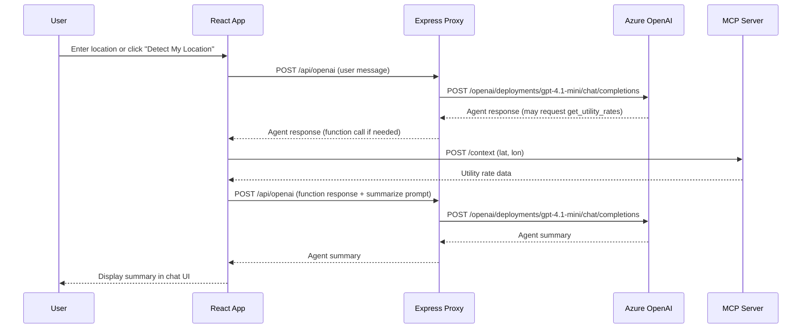

# Copilot Architecture Diagram (Mermaid)

```mermaid
sequenceDiagram
    participant User
    participant Frontend as React App
    participant Backend as Express Proxy
    participant OpenAI as Azure OpenAI
    participant MCP as MCP Server

    User->>Frontend: Enter location or click "Detect My Location"
    Frontend->>Backend: POST /api/openai (user message)
    Backend->>OpenAI: POST /openai/deployments/gpt-4.1-mini/chat/completions
    OpenAI-->>Backend: Agent response (may request get_utility_rates)
    Backend-->>Frontend: Agent response (function call if needed)
    Frontend->>MCP: POST /context (lat, lon)
    MCP-->>Frontend: Utility rate data
    Frontend->>Backend: POST /api/openai (function response + summarize prompt)
    Backend->>OpenAI: POST /openai/deployments/gpt-4.1-mini/chat/completions
    OpenAI-->>Backend: Agent summary
    Backend-->>Frontend: Agent summary
    Frontend-->>User: Display summary in chat UI
```
