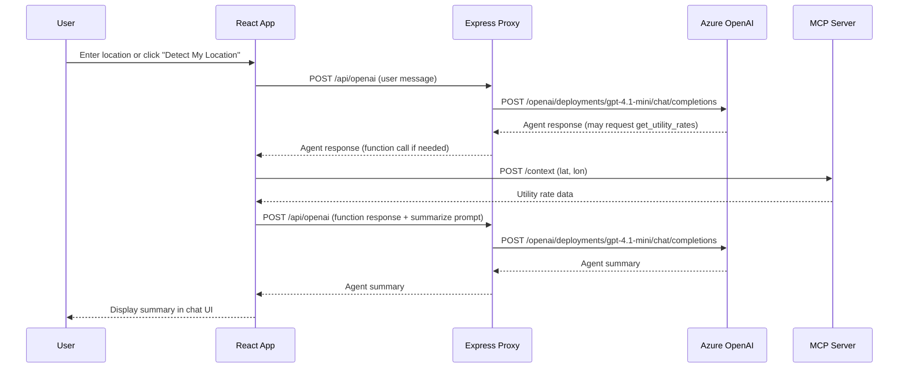

# Copilot Workspace Instructions for Utility WebUI

## Overview
This project is a React + Vite web app with a Node.js Express backend proxy. It provides a chat interface to an agent powered by Azure OpenAI (GPT-4.1 mini) and an MCP (Model Context Protocol) server. The agent can answer utility rate questions by determining the user's location, calling the MCP server for utility data, and summarizing the results for the user.

## Key Components
- **Frontend (React, Vite)**
  - `src/App.tsx`: Main chat UI and agent orchestration logic.
  - `src/openaiSdkClient.ts`: Sends chat requests to the backend proxy.
  - `src/mcpClient.ts`: Utility for calling the MCP server for utility data.
  - `src/config.ts`: (local only, gitignored) for frontend secrets if needed.
- **Backend (Node.js, Express)**
  - `server.js`: Proxies chat requests to Azure OpenAI using environment variables for secrets. Loads secrets from `.env` via `dotenv`.
- **Secrets**
  - `.env`: Stores `OPENAI_ENDPOINT` and `OPENAI_API_KEY` for backend. This file is gitignored.

## How It Works
1. User enters a location or uses geolocation in the chat UI.
2. The frontend sends the chat message to the backend proxy (`/api/openai`).
3. The backend proxy forwards the request to Azure OpenAI using the REST API and your API key.
4. If the agent requests utility data (via function/tool call), the frontend calls the MCP server for utility rates.
5. The frontend sends the MCP data back to the agent for summarization.
6. The agent responds with a user-friendly summary, which is displayed in the chat.

## Environment Setup
- Place your OpenAI endpoint and API key in a `.env` file at the project root:
  ```
  OPENAI_ENDPOINT=...
  OPENAI_API_KEY=...
  ```
- Do not commit `.env` or `src/config.ts` (if used) to source control.

## Adding Features
- To add new tools/functions, update the `mcpFunction` or add new function definitions in `App.tsx`.
- To change the backend model or endpoint, update `.env`.
- For new data sources, extend `mcpClient.ts` and update the agent orchestration in `App.tsx`.

---

## Architecture Diagram (Mermaid)



---

**Summary:**
This setup keeps secrets secure, enables easy extension, and provides a clear separation between UI, orchestration, and data fetching. The diagram shows the flow from user input to agent response, including the MCP server integration.
